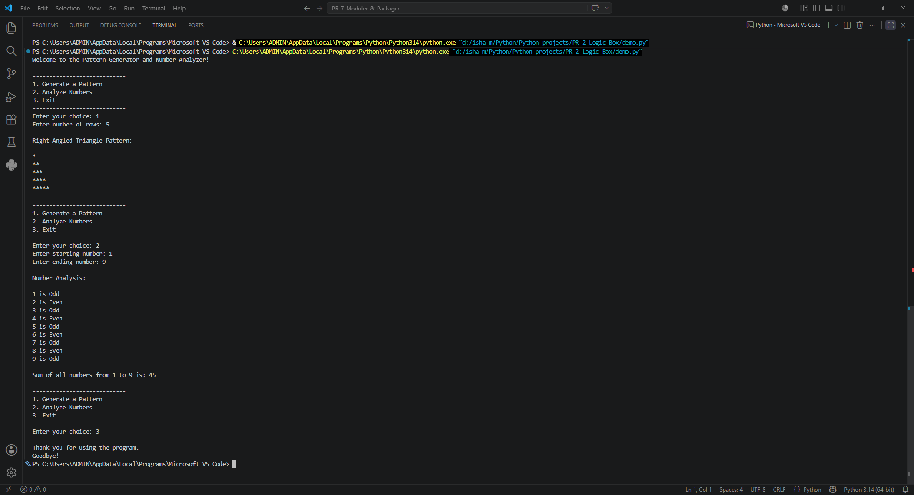

# PR_2_Logic-Box

# 📂 Project Name: Logic Box
**Pattern Generator and Number Analyzer**

---

## 📌 1. Project Overview
**Logic Box** is an interactive, menu-driven Python terminal application designed to showcase control flow mechanisms, looping constructs, and mathematical logic structures. The application provides two main functionalities through a persistent user interface: a customizable star pattern generator and a range-based statistical number analyzer.

The program runs inside a continuous loop, allowing users to perform multiple operations, validate operational inputs, filter numbers dynamically, and exit smoothly whenever they choose. It highlights practical implementations of nested iterations and conditional logic flags in Python development.

---

## 🚀 2. Features
- **Menu-Driven Interface:** Built with a persistent `while True` loop that keeps the application running until explicitly terminated by the user.
- **Dynamic Pattern Generator:** Uses nested loops to dynamically render a geometric Right-Angled Triangle pattern based on user-defined row counts.
- **Comprehensive Number Analyzer:** Loops through user-specified numerical ranges (start to end values) to evaluate properties of each integer.
- **Parity Checking:** Automatically identifies and labels integers in a sequence as either **Even** or **Odd**.
- **Cumulative Calculations:** Aggregates and displays the mathematical sum of all numbers compiled within the specified range.
- **Input Validation Safeguards:** Prevents execution failures by checking bounds (e.g., ensuring rows > 0 and ending values are greater than starting points).
- **Control Jump Statements:** Successfully implements statement bypasses using Python's native `continue` and `pass` keyword signals.

---

## 🛠️ 3. Language & Tech Stack
The project is built entirely using vanilla Python features, ensuring optimal lightweight execution.

| Component | Technical Specification |
| :--- | :--- |
| **Core Language** | Python 3.x |
| **Execution Environment** | Command Line Interface (CLI) / Terminal |
| **Control Structures** | `while` Loops, `for` Loops, Nested Iterations |
| **Jump Conditionals** | `break`, `continue`, `pass` |
| **Core Operations** | Modulo Arithmetic (`%`), Accumulator Pattern (`total += number`) |

---

## 📦 4. Installation & Usage

### How to Run the Project:
1. Clone this repository or download the `demo.py` file to your environment.
2. Open your terminal or VS Code terminal console.
3. Run the script using the following execution command:
   ```bash
   python demo.py
📷 5. Project Execution Output (Screenshots)
Below is the complete step-by-step terminal execution flow showing the interactive features of the Logic Box script:




🎓 6. Core Concepts Explored
By building this program, the following essential structural development principles were covered:

Managing persistent states using conditional boolean loops (while True).

Working with mathematical range generators (range(start, end + 1)).

Layering multidimensional logic blocks using Nested Loops to form structures.

Utilizing operational filtering conditions via continue to handle boundary conditions (like skipping zero).

Formatting layout grids and console tables using Python's standard print(..., end="") modifiers.
